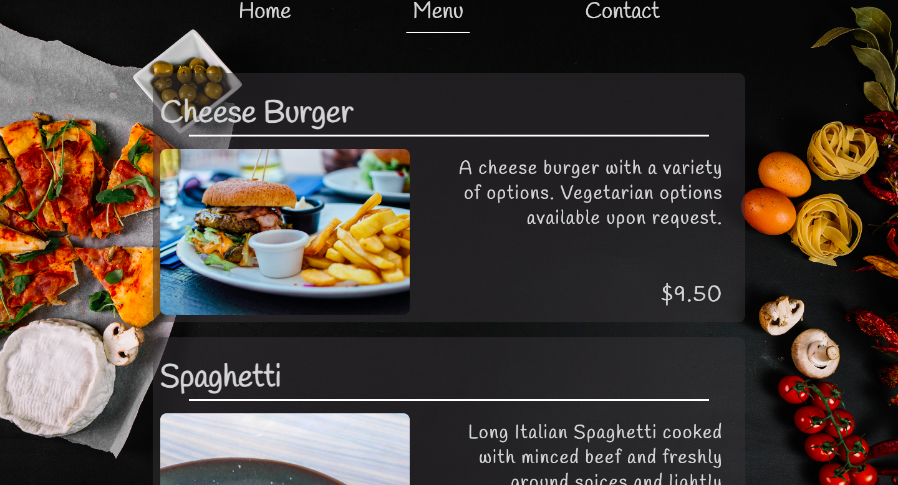
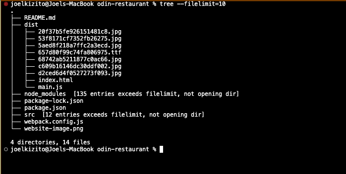

# Odin Web Development Project - Restaurant Page

## Live Site : [Joel's Bistro](kizitojoel.github.io/odin-restaurant/)



## Stage 1 | Webpack setup and template development
I ran npm init to initailise the package.json folder and keep track of the installed packages
I edited the basic layout of my webpage and downloaded different fonts and backgrounds and tried them out



### Concepts I learned
- Difference between dev dependencies and dependencies
- How to set up webpack modules and setting up the webpack.config.js page.
- Running webpack scripts inside of my package.json, such as build, watch and others
```JSON
"scripts": {
    "test": "echo \"Error: no test specified\" && exit 1",
    "build": "webpack",
    "watch": "webpack --watch"
  },
```
- Choosing color palettes

## Stage 2 | Setting up tabs
I implemented a tab style website using javascript generated content and event listeners

### Concepts I learned:
- Transform transitions and HTML pseudo-selectors
- Manipulating the DOM using javascript. (classList, dot notation, HTML Collections, HTML elements vs Nodes, query Selectors etc.)
- Exporting modules and importing modules. Difference between default exports and named exports and how we import them each.
- Handling images using webpack.
- Writing functions to automate generating HTML using Javascript and returning those elements so that I can append them to the page
```Javascript
function createMenuElement(foodName, foodDescription, foodPrice, imageSource){
    const line = document.createElement("div");
    line.classList.add("line");
    const menu1 = document.createElement("div");
    menu1.classList.add("menu");
    const h1 = document.createElement("h1");
    h1.textContent = foodName;
    h1.append(line);
    const p1 = document.createElement("p");
    p1.textContent = foodDescription;
    const price1 = document.createElement("span");
    price1.textContent = foodPrice;
    price1.classList.add("price");
    p1.append(price1);
    const image1 = new Image();
    image1.src = imageSource;

    menu1.append(h1,image1, p1);

    return menu1;
}
``` 
- Implementing a fixed background using CSS
```CSS
body{
    background-color: black;
    background-image: url(./background1.jpg);
    background-repeat: no-repeat;
    background-size: cover;
    background-attachment: fixed ;
}
```

## Stage 3 | Publishing
Using webpack and publishing to GitHub pages needs a different approach since gh pages usually looks for the index.html file in the root directory.

Here is a link to the longer gist : [Publishing from a GitHub subdirectory](https://gist.github.com/cobyism/4730490)

### How to do it
- Assuming my sub directory is called and there is an index.html file in the subdirectory, ensure all files are added and committed. Then run
```git
git subtree push --prefix dist origin gh-pages
```
Done😀

Attributions:
- [Background Image by Valeria_aksakova on Freepik](https://www.freepik.com/free-photo/frying-pan-empty-with-various-spices-black-table_984003.htm#query=food%20black%20background&position=16&from_view=keyword&track=ais)
